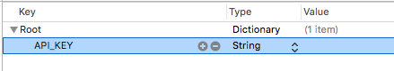
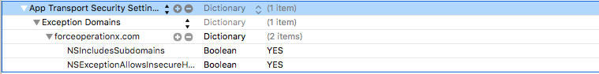
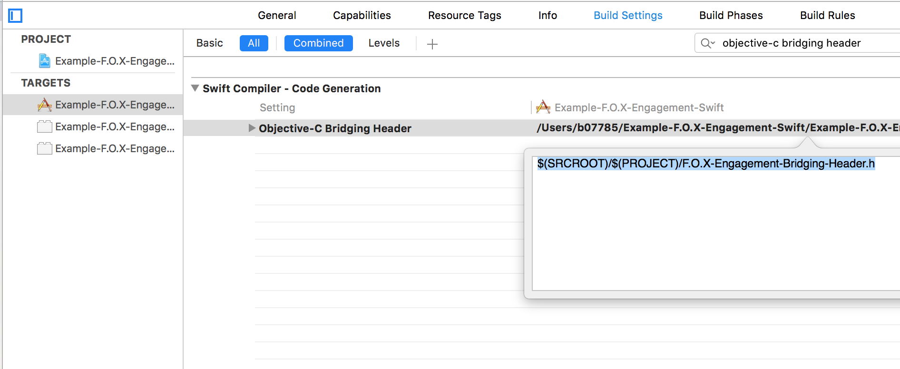

 


# - F.O.X Engagement iOS Integration Guide -

[](https://developer.apple.com/iphone/index.action)
[](https://developer.apple.com/jp/documentation/)
[](https://developer.apple.com/swift/)
[](https://developer.apple.com/swift/)
[](Perfect/release)


## F.O.Xエンゲージメント配信とは

本サービスは、以下２つのキャンペーンを配信するためのネットワーク広告となっています。

* **アクション目的の広告配信**

データフィードを活用しダイナミッククリエイティブ、レコメンド広告を配信します。

* **インストール目的の広告配信**

アドネットワークのようなピクチャーバナーによる広告を配信します。

## 目次

* **[1. インストール](#install)**
* **[2. API](#about_api)**
* **[3. コードへの組み込み](#code_sample)**

<div id="install"></div>
## 1. インストール

### 1.1 入手

* **CocoaPodsによって導入する場合**

Podfileファイルに下記の設定を追加してください。
```ruby
foxEngagementVersion = "1.0.0"
pod 'foxEngagement' , :podspec =>"https://github.com/cyber-z/public-foxEngagement-ios-sdk/raw/#{foxEngagementVersion}/cocoapods/foxEngagement.podspec"
```

* **マニュアル導入する場合**

SDK本体を[こちら](../../releases)よりダウンロードしてください。
ダウンロードしたSDKを展開し、ライブラリファイルをアプリケーションのプロジェクトに組み込んでください。

### 1.2 ライブラリ内訳
* libFoxEngagementSdk.a
* FEGAdView.h
* FEGAdStateDelegate.h

### 1.3 必要なframework
* UIKit.framework
* Foundation.framework
* AdSupport.framework

### 1.4 plist設定ファイル
**ファイル名**

* `FoxEngagement.plist`

plistを[こちら](Resouce/FoxEngagement.plist)よりダウンロードしてください。
ダウンロードしたplistをアプリケーションのプロジェクトに組み込んでください。


**設定項目**

* `API_KEY` 値は案件開始時に弊社より発行させて頂くIDとなります。
広告表示に必須となります。

|キー|バリュー|
|---:|:---|
|API_KEY|値は案件開始時に弊社より発行させて頂くIDとなります。広告表示に必須となります。|

 

### 1.5 App Transport Security (ATS)設定
ATSを有効した場合、NSExceptionDomainsに下記の設定を追加してください。

```xml
<key>NSAppTransportSecurity</key>
<dict>
	<key>NSExceptionDomains</key>
	<dict>
		<key>forceoperationx.com</key>
		<dict>
			<key>NSIncludesSubdomains</key>
			<true/>
			<key>NSExceptionAllowsInsecureHTTPLoads</key>
			<true/>
		</dict>
	</dict>
</dict>
```



<div id="about_api"></div>
## 2. API

### FEGAdView
|プローパティー|タイプ|詳細|
|---:|:---|:---|
|placementId|NSString|広告表示ID(管理者より発行されます)|
|size|Enum|広告表示サイズ|
|adStateDelegate|id<DLAdStateDelegate>|広告表示の際のイベントを取得するためのdelegate|

|返り値型|メソッド|詳細|
|---:|:---|:---|
|void|show|広告を表示します。|

### FEG_ADVIEW_SIZE

|型|変数名|詳細|
|:---:|:---:|:---|
|NS_ENUM|FEG_ADVIEW_SIZE_320x50|横320×縦50(ピクセル)の広告をリクエストします|
|NS_ENUM|FEG_ADVIEW_SIZE_320x100|横320×縦100(ピクセル)の広告をリクエストします|
|NS_ENUM|FEG_ADVIEW_SIZE_300x250|横300×縦250(ピクセル)の広告をリクエストします|
|NS_ENUM|FEG_ADVIEW_SIZE_336x280|横336×縦280(ピクセル)の広告をリクエストします|
|NS_ENUM|FEG_ADVIEW_SIZE_112x112|横112×縦112(ピクセル)の広告をリクエストします|

### FEGAdStateDelegate
|返り値型|メソッド|詳細|
|---:|:---|:---|
|void|onAdSuccess ( UIView v )<br><br>`v` : 広告のView|広告の表示が正常だった場合に呼ばれます。|
|void|onAdFailed ( UIView v ) <br><br> `v` : 広告のView|広告が表示できなかった場合に呼ばれます。|
|void|onAdClicked ( UIView v ) <br><br> `v` : 広告のView|広告がクリックされた場合に呼ばれます。|
|BOOL|onAdFallback ( UIView v ) <br><br> `v` : 広告のView|表示する広告がなかった場合に呼ばれます。Fallbackの場合、メディア側で用意したクリエイティブを表示することが可能となっています。<br>その場合は返り値にYESを指定してください。また、任意の処理を行うため広告枠を非表示にする場合にはNOを返してください。|

> ・onAdFallbackが発生しYESを返した場合、メディア側で用意したクリエイティブが表示される際のonAdSuccessとonAdFailedは呼ばれません。

<div id="code_sample"></div>
## 3. コードへの組み込み

Objective-Cで実装する際は下記を広告表示サンプル1と広告表示サンプル2を参考にしてください。
Swiftで実装する際はF.O.X-Engagement-Bridging-Headerを[こちら](https://github.com/cyber-z/public-foxengagement-ios-sdk/blob/master/Resouce/F.O.X-Engagement-Bridging-Header.h)よりダウンロードしてください。
ダウンロードしたF.O.X-Engagement-Bridging-Headerをアプリケーションのプロジェクトに組み込んでください。
また下記のようにプロジェクトファイルを編集し、広告表示サンプル3と広告表示サンプル4を参考にしてください。


### 3.1 広告表示サンプル １ (Objective-C)

```objc

#import "FEGAdStateDelegate.h"
#import "FEGAdView.h"

NSString* placementId = xxx; // 管理者より発行される
CGRect frame = CGRectMake(x, y, 0, 0);;// 場所だけ指定する
FEGAdView* adView = [[FEGAdView alloc] initWithFrame:frame];
adView.placementId = placementId;
adView.size = FEG_ADVIEW_SIZE_320x50;
[parentView addSubview:adView];
[adView show];

```

### 3.2 広告表示サンプル 2 (Objective-C)

```objc
#import "FEGAdStateDelegate.h"
#import "FEGAdView.h"

@interface UIViewController ()<FEGAdBannerStateDelegate>
@end

NSString* placementId = xxx; // 管理者より発行される
CGRect frame = CGRectMake(x, y, 0, 0);;// 場所だけ指定する
FEGAdView* adView = [[FEGAdView alloc] initWithFrame:frame];
adView.placementId = placementId;
adView.size = FEG_ADVIEW_SIZE_320x50;
adView.adStateDelegate = adStateDelegate;
[parentView addSubview:adView];
[adView show];


// FEGAdStateDelegate 実装
-(void) onAdSuccess:(UIView *) view {
    NSLog(@"onAdSuccess delegate implement");
}
-(void) onAdFailed:(UIView *) view {
    NSLog(@"onAdFailed delegate implement");
}
-(void) onAdClicked:(UIView*) view {
    NSLog(@"onAdClicked delegate implement");
}
-(BOOL) onAdFallback:(UIView*) view {
    NSLog(@"onAdFallback delegate implement");
    return NO;
}
```

### 3.3 広告表示サンプル 3 (Swift)

```swift
let placementId: String = "XXX" // 管理者より発行される
let frame: CGRect = CGRectMake(x, y, 0, 0) // 場所だけ指定する
let adView: FEGAdView = FEGAdView(frame: frame)
adView.placementId = placementId
adView.size = FEG_ADVIEW_SIZE._320x50
parentView.addSubview(adView)
adView.show()
```

### 3.4 広告表示サンプル 4 (Swift)

```swift
class ViewController: UIViewController,FEGAdBannerStateDelegate {

    override func viewDidLoad() {
        super.viewDidLoad()
        
        let placementId: String = "XXX" // 管理者より発行される
        let frame: CGRect = CGRectMake(x, y, 0, 0) // 場所だけ指定する
        let adView: FEGAdView = FEGAdView(frame: frame)
        adView.placementId = placementId
        adView.size = FEG_ADVIEW_SIZE._320x50
        adView.adStateDelegate = self
        parentView.addSubview(adView)
        adView.show()
    }
    
    // FEGAdStateDelegate 実装
    func onAdSuccess(view: UIView!) {
        print("onAdSuccess delegate implement")
    }
    func onAdFailed(view: UIView!) {
        print("onAdFailed delegate implement")
    }
    func onAdClicked(view: UIView!) {
        print("onAdClicked delegate implement")
    }
    func onAdFallback(view: UIView!) -> Bool {
        print("onAdFallback delegate implement")
        return false
    }
}
```
